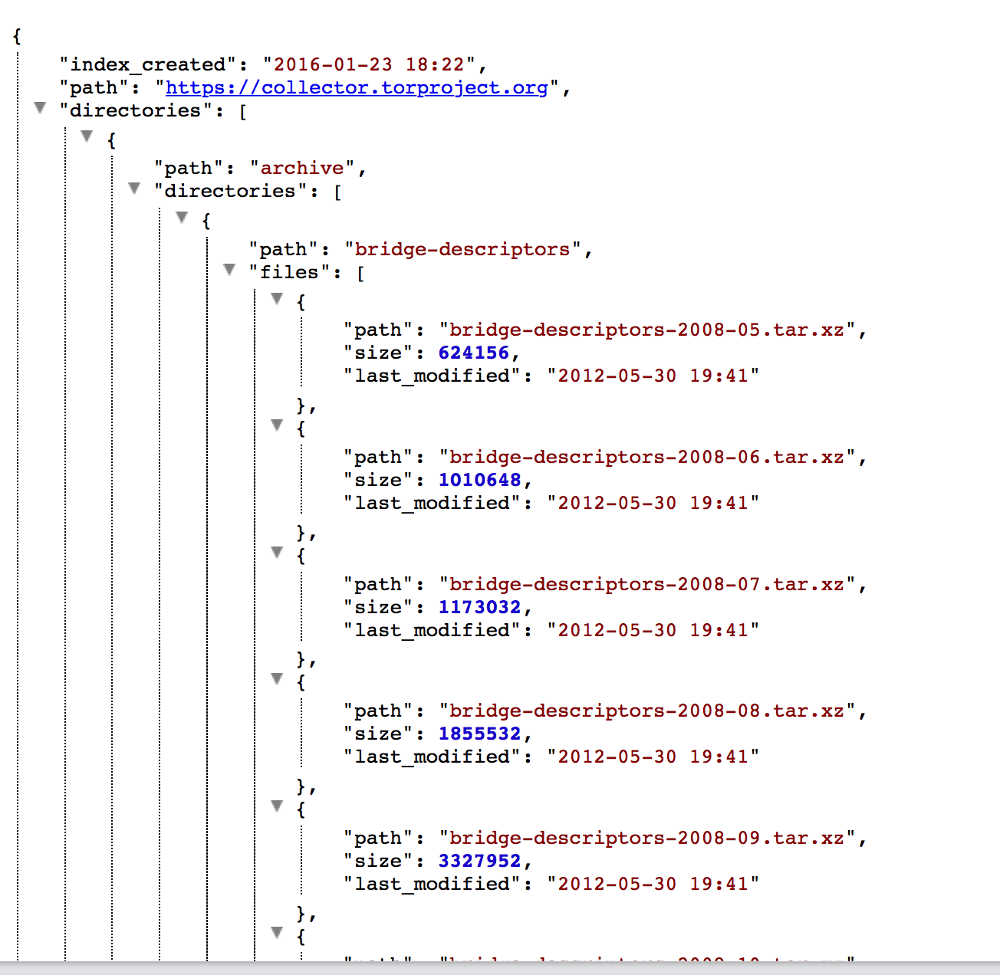

---
output:
  html_document:
    keep_md: true
  md_document:
    variant: markdown_github
---

`jsonview` : View formatted and "pretty printed" JSON or `list`s in R

(if you need XML viewing in R check out `jsonview`'s sister package, [xmlview](https://github.com/hrbrmstr/xmlview))

It is intended for interactive use. When working with gnarly lists or JSON data, it's often times advantageous to be able to see the document in a more formatted way.

You can pass in:

- plain character JSON
- an R `list` object (any R object, really)

and view the formatted & pretty-printed result in the RStudio viewer or web browser.

Here's an example of the collapsable tree view generaged by:
```{r eval=FALSE}
json_tree_view(fromJSON("https://collector.torproject.org/index.json"))
```



The widget uses  [vkbeautify](http://www.eslinstructor.net/vkbeautify/), [highlight.js](https://highlightjs.org) and 
[jquery.json-treeview](https://github.com/bazh/a.json-view) to do all the work.

The following functions are implemented:

- `json_view`: view JSON, formatted & pretty-printed
- `json_tree_view`: view JSON in a collapsable tree view

### News

- Version 0.2.0 : `json_tree_view()`
- Version 0.1.0 released

### Installation

```{r eval=FALSE}
devtools::install_github("hrbrmstr/jsonview")
```

```{r echo=FALSE, message=FALSE, warning=FALSE, error=FALSE}
options(width=120)
```

### Usage

```{r eval=FALSE}
library(xmlview)
library(jsonlite)

# available styles
highlight_styles()

# plain character
txt <- '{
"glossary": {
"title": "example glossary",
"GlossDiv": {
"title": "S",
"GlossList": {
"GlossEntry": {
"ID": "SGML",
"SortAs": "SGML",
"GlossTerm": "Standard Generalized Markup Language",
"Acronym": "SGML",
"Abbrev": "ISO 8879:1986",
"GlossDef": {
"para": "A meta-markup language, used to create markup languages such as DocBook.",
"GlossSeeAlso": ["GML", "XML"]
},
"GlossSee": "markup"
}
}
}
}
}'
  
json_view(txt)
json_tree_view(txt)

doc <- fromJSON(txt)
json_view(doc, style="obsidian")
json_tree_view(doc)

json_view(readLines("https://collector.torproject.org/index.json", warn=FALSE))

json_tree_view(readLines("https://collector.torproject.org/index.json", warn=FALSE))

json_tree_view(fromJSON("https://collector.torproject.org/index.json"))

json_view(fromJSON("https://collector.torproject.org/index.json",
                   simplifyVector=FALSE))
```
